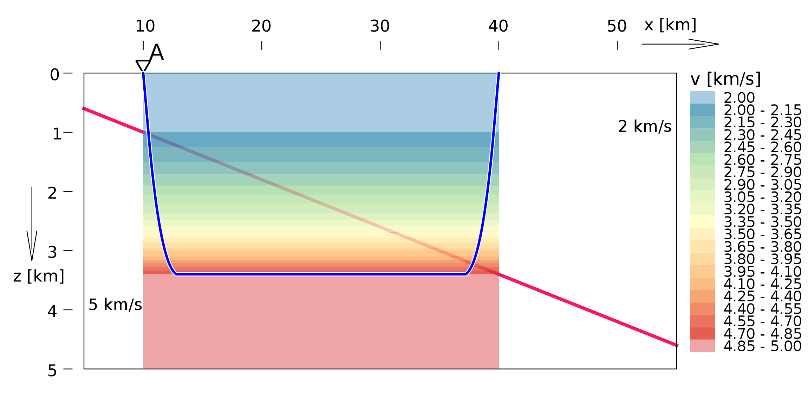

# hypo3d
HYPO3D is a computer program for determining hypocenter and magnitude of local earthquakes.
The program is an attempt to solve the location of the earthquake in a 3-dimensional velocity model.
Author Milan Werl wrote this program under the guidance of Petr Firbas in the years 1986-1988.
This software has been in use at the Institute of Physics of the Earth, Masaryk University in Brno.

## Program features and limitations

The program is an implementation of the classical Geiger’s method for earthquake location.
Another inspiration was the HYPO71 (http://www.jclahr.com/science/software/hypo71/index.html)
[[Lee and Lahr 1975](#lee1975)], 
ray tracing is based on a modified TRVDRV subroutine written by [[Eaton 1969](#eaton1969)].

### Velocity model
The 3-dimensional velocity model is constructed from rectangular homogeneous blocks.
The space of the model is divided into blocks in three perpendicular directions by parallel planes with irregular spacings.
The number of blocks is limited to 100x100x100.
The velocities of longitudial seismic waves in units of [km/s] are assigned to these blocks.

<p align="center">

<br>
Cross-wall structure of the 3-d velocity model
</p>

On the upper side the structure is bounded by a surface, which is defined by spline interpolation in the network of points.


### Forward modelling
The program HYPO3D reflects the 3-dimensional model only in a limited way.
The ray-tracing is solved in 1-dimensional layered model reduced from 3-d for each section 
between the source and the receiver point.   
Travel-time is calculated for each source-receiver pair in the following steps:  
1) A vertical plane cross-section of the 3-d velocity model is made between the source and the receiver.  
2) The conversion procedure for the 1-d model consists in preserving horizontal layers (the floor in the cross-wall structure of the 3-d model) and the seismic velocities in each layer are merged into one velocity so that the travel-time between the source and the receiver in this layer is equivalent (time-averaged velocity).   
3) A ray is computed in the 1-d velocity model, using two-point fast ray-tracing scheme taken from the HYPO71.   
4) The travel-time is then calculated by integrating in the 3-d velocity model along the ray path approximately calculated in the previous step.

The authors of the computer program justify this approach by reference to
[[Romanov 1972](#romanov1972), [Firbas 1984](#firbas1984)]
and consider this solution to be a linearization approach.

### Applicability limits
We see that the described solution of forward modelling is a type of noniterative perturbation method.
This method assumes that the problem is regular (a small perturbance in ray-path will cause small difference in the travel-time).
This is not case for all type of seismic phases.
It is known [[Ryaboy 2001](#ryaboy2001)] that described procedure does not guarantee sufficient accuracy 
for refracted or head waves that pass along curved or sloping interfaces.
<!-- [[Ryaboy 2001](#ryaboy2001)] writes that
the linearization approach, which can be successfully applied in seismic tomography,
is not directly applicable to our problem because it does not guarantee the accuracy needed for regional phases,
whose ray paths are passing close to the curved surface. -->

<p align="center">

<br>
Hypo3d ray tracing along the dipping planar interface.
</p>

The HYPO3D program was originally designed to locate an earthquake using short-distance direct phases in a local seismic network.
In the case of the location of an regional-distance earthquake in a complex 3-dimensional velocity model, the problem may not be sufficiently regular.

### Coordinates
The map coordinate system S-JTSK Křovák EPSG:5513 is used for program input and output
(but the unit is [km]).
This coordinate system is defined only for Czech Republic, Slovakia, and near border regions.

The velocity model is defined in local coordinates.
For most internal calculations, the model local coordinate system is used.
This brings some limitations, especially in the case of fixing hypocenter in some coordinates.

### Weighting
The weighted least squares algorithm takes into account the specified weight codes 
for phase arrivals measurements. 
These weight codes are:
```
 0 - full weight, 1 - 3/4 weight, 2 - half weight, 3 - 1/4 weight, 4 - no weight
(as in HYPO71, HYPOINVERSE)
```

Weights are used as coefficients of the objective function linearly, not quadraticaly,
which means that their weighting effect is rather weak (except code ```4 - no weight```).
 
## Authors
<table>
<tbody>
<tr class="odd">
<td>Petr Firbas, Luděk Klimeš</td>
<td>1986</td>
<td>Initial work.</td>
</tr>
<tr class="even">
<td><a href="https://cz.linkedin.com/in/milan-werl-a174357"><strong>Milan Werl</strong></a></td>
<td>1986-1987</td>
<td>Researcher and programmer for the most of the code.</td>
</tr>
<tr class="odd">
<td>Vladimír Dvořák and Libor Vejmělek</td>
<td>1996</td>
<td>Porting program of HP minicomputer platform to SUN workstation.</td>
</tr>
</tbody>
</table>

The program includes parts of the library FITPACK (coded by Alan Kaylor Cline) and
subroutines of IBM SSP (Scientific Subroutine Package).

## Plans
HYPO3D program has been used for 30 years with minimal modifications. 
This project is intended for maintenance of code and documentation and
to test and document the limitations of this program.
No further development is foreseen but for further use it is needed:

1. Reduce unnecessary code for clarity.
1. Fix some known bugs.
1. Gather documentation of this software.

## Upgrades

There are only minor changes compared to the original version 10.50, 
which does not change the features of the computer program.

1. To clear the code, about 9,000 lines of program code were removed.
   Deleting unreachable or unusable code did not affect the functionality.
2. The parameter reading_error was originally hard coded.
   Now the default value can be overwritten
   as a second optional argument in the velocity model file (line number 5th).
3. The coordinates x,y of the epicenter and their estimate errors dxer,dyer
   were presented in different coordinate systems.
   (Epicenter in map coordinates Křovák EPSG:5513 but errors in model local coordinates).
   Now it is consistently in map coordinates. 
4. In the case of coordinate fixation, 
   the calculation of the error covariance matrix is not reduced in dimensions.
5. The azimuth of rays emerging from the focus and the angle
   of rotation of the error ellipse is counted with respect
   to meridian convergence of Křovák coordinates at the focal point.
6. The limitation of the number of blocks of the velocity model was extended 
   from the original 15x15x40 to 100x100x100.
7. A posteriori estimation of the arrivals variance was not an unbiased estimate 
   because the individual residues were first modified 
   according to a priori specified reading error. 
   Newly, the estimate of the arrivals variance is calculated first 
   and then adjusted by the reading error value.


## Documentation

The original documentation of the program is in the report
[Firbas P., Werl M.: HYPO3D, rev. 9.00. Lokalizace ve 3D blokovém prostředí. Etapová zpráva. Geofyzika n.p., Brno 1988](https://github.com/firbas/hypo3d/blob/master/doc/hypo3d_Werl.pdf)

Additional information
([starting the program](https://github.com/firbas/hypo3d/wiki#starting-the-hypo3d-program), formats)
is available at the wiki site:   
https://github.com/firbas/hypo3d/wiki

## Licence
HYPO3D is primarily designed for users in Institute of Physics of the Earth, Masaryk University in Brno.
The computer program is free to use. 
But note that this is the working repository and not an end-user release
and consider the limited capabilities of the program.

## Literature

<a name="eaton1969"></a>Eaton, J. P. (1969). HYPOLAYR, a computer program for determining hypocenters of local earthquakes in an earth consisting of uniform flat layers over a half space, Open File Report, U.S. Geological Survey, 155 pp.

<a name="firbas1984"></a>Firbas, P. & Vaněk, J. (1984). Travel time curves for complex inhomogeneous slightly anisotropic media. Stud Geophys Geod (1984) 28: 393-406.
DOI https://doi.org/10.1007/BF01642992

<a name="lee1975"></a>Lee, W. H. K. and J. C. Lahr (1975). HYP071 (Revised): A computer program for determining hypocenter, magnitude, and first motion pattern of local earthquakes, U. S. Geological Survey Open File Report 75-311, 113 pp. 

<a name="romanov1972"></a>Романов В. Г. (1972). Некоторые обратные задачи для уравнений гиперболического типа. Издательство "Наукa", Новосибирск, 1972

<a name="ryaboy2001"></a>Ryaboy V., Baumgardt D.R., Firbas P., Dainty A.M. (2001). Application of 3-D crustal and upper mantle velocity model of North America for Location of Regional Seismic Events. Pure appl. geophys. 158 (2001) 79-103. Birkhäuser Verlag, Basel, 2001.
DOI https://doi.org/10.1007/PL00001169

